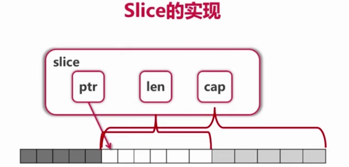

# Go语言基础知识点
## 函数
### 函数签名（函数类型）
相当于函数指针、java的函数式接口
~~~ golang
// 代表两个参数一个返回值的函数签名
type Op func(int, int) int

func do(op Op, a int, b int) {
    return Op(a, b)
}
~~~
### 闭包
定义：闭包由函数及其相关引用环境组合而成的实体，通过匿名函数中引用外部函数的局部变量或者包全局变量构成，
* 多次调用返回闭包的函数（如test()）,返回的多个闭包的外部变量是多个副本
* 多次调用一个闭包（如f()），多次调用共享一个闭包数据，会有影响
~~~ golang
func test() func() {
	a := 12
	f := func() {
		a++
		fmt.Println(a)
	}
	return f
}
func main() {
	f := test()
	f() // 13
	f() // 14
}
~~~
对象是附有行为的数据，闭包是附有数据的行为
## 容器
### slice
* 切片

本质上是一个arr的视图，底层由arr实现

len: slice的截取长度，用下标访问的时候不能超过len  
cap: slice的头指针到底层arr的len位置  
截取极限为底层arr的len位置
~~~
arr := [...]int{0, 1, 2, 3, 4, 5, 6}
fmt.Println("len is : ", len(arr[2:5])) // 3
fmt.Println("cap is : ", cap(arr[2:5])) // 5
fmt.Println("len is : ", len(arr[3:5])) // 2
fmt.Println("cap is : ", cap(arr[3:5])) // 4
~~~
* append(添加元素)

在append过程中如果超过了cap的限制，会重新分配一个arr来生成slice
* copy

只会复制交集部分数据，不会延伸到其他位置
## type 定义与别名
### type MyInt = int
表示定义一个int的别名，在编译之后将不会存在MyInt
### type MyInt int
表示定义一个类型MyInt，底层为基本类型int,也可以自己强化int
## 接口
### 值接受者和指针接受者的区别
~~~
type Node struct {
	Val  string
	Next *Node
}

func (node *Node) String() string {
	return fmt.Sprintf("node is %s", node.Val)
}

func main() {
	var node fmt.Stringer
	node = new(Node)
	node = Node{} // 报错；以指针接收的方式实现接口只能用指针类型
    node = &Node{} // 没问题.
}
~~~
* 以指针接收实现
    * var name 接口 = 指针类型 ✔  
    * var name 接口 = 值类型 ✖  
* 以值接收实现
    * var name 接口 = 指针类型 ✔
    * var name 接口 = 值类型 ✖
### 取得接口的真实类型
1. switch node.(type)
2. obj, ok = node.(Node) // 强转
3. fmt.printf("%T", node) // 输出